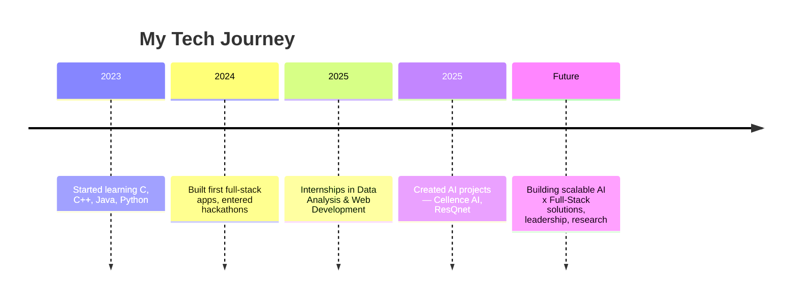

<!-- Profile README for GitHub | Jabez Jena (Refined) -->

<!-- ============================= HERO ============================= -->

<p align="center">
  
</p>

<p align="center">
  <a href="https://github.com/JabezJesudasonJena"></a>
  <a href="mailto:jabezjenaofficial@gmail.com"></a>
  <a href="https://linkedin.com/in/jabezjena"></a>
</p>

<!-- ============================= TERMINAL INTRO ============================= -->

```bash
$ whoami
> Jabez Jena: AI Explorer & Full Stack Builder

$ motto
> "I don’t just build projects. I build solutions."
```

<!-- ============================= QUICK STATS ============================= -->

<div align="center">

<a href="https://github.com/anuraghazra/github-readme-stats">
  
</a>
<a href="https://git.io/streak-stats">
  
</a>

</div>

<!-- ============================= CONTRIBUTION SNAKE ============================= -->

## 🐍 Contribution Snake

<p align="center">
  
</p>

<!-- ============================= FEATURED PROJECTS ============================= -->

## 🚀 Featured Projects

<table>
  <tr>
    <td width="33%" align="center">
      <a href="https://github.com/JabezJesudasonJena/Cellence-Drug-Discovery-model">
        <b>Cellence AI</b>
      </a>
      <br/>
      <sub>Drug Discovery • MolGPT • Deep Learning</sub>
    </td>
    <td width="33%" align="center">
      <a href="https://jabezjesudasonjena.github.io/ResQnet/">
        <b>ResQnet</b>
      </a>
      <br/>
      <sub>Disaster Management • AI Assistant • Alerts</sub>
    </td>
    <td width="33%" align="center">
      <a href="#zaymazone">
        <b>Zaymazone</b>
      </a>
      <br/>
      <sub>MERN • Tailwind • E‑commerce for artisans</sub>
    </td>
  </tr>
</table>

<!-- ============================= TIMELINE ============================= -->

## ⏳ Journey Timeline



<!-- ============================= TOOLBOX ============================= -->

## 🧰 Toolbox

<p>
  
  
  
  
  
  
  
  
  
</p>

<!-- ============================= NOW SECTION ============================= -->

## 📌 Currently

* Exploring **Generative AI with Gemini API**
* Building advanced **data-driven dashboards**
* Leading project teams in hackathons

<!-- ============================= CERTIFICATIONS ============================= -->

## 🎓 Certifications

* Microsoft Azure AI Fundamentals • Azure Fundamentals
* MongoDB Basics
* Postman AI Fundamentals — Student Expert
* Google Cloud Gemini & Imagen Skill Badges

<!-- ============================= CONTACT ============================= -->

## 📫 Let’s Collaborate

* 🐙 GitHub: <a href="https://github.com/JabezJesudasonJena">@JabezJesudasonJena</a>
* 💼 LinkedIn: <a href="https://linkedin.com/in/jabezjena">jabezjena</a>
* ✉️ Email: <a href="mailto:jabezjenaofficial@gmail.com">[jabezjenaofficial@gmail.com](mailto:jabezjenaofficial@gmail.com)</a>
