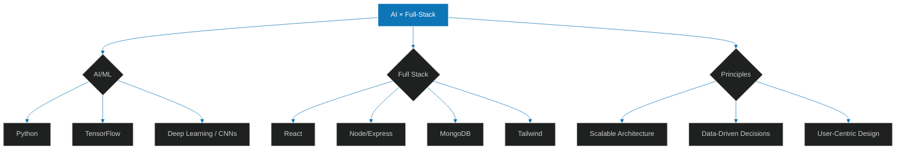

<!-- Profile README for GitHub | Jabez Jena -->

<!-- ============================= HERO ============================= -->

  

  
  
  
  

<!-- Animated divider (wave) -->

  

<!-- ============================= ONE-LINER ============================= -->

  <b>I turn ideas into working products</b> — from <i>deep learning</i> experiments to <i>full‑stack</i> apps with clean UX.

<!-- ============================= QUICK STATS (ANIMATED) ============================= -->

<!-- ============================= HIGHLIGHTS ============================= -->

## ✨ Highlights

* **Data Analyst Intern** @ *EinNel Technologies* — building insights dashboards with **Angular** & data viz.
* **Web Developer Intern** @ *Thenam Software Solutions* — crafted a MERN + **Tailwind** e‑commerce for artisans.
* Led teams in **hackathons** and **GDG Solution Challenge**; presented technical papers; fluent in **Tamil | English | Hindi | Odia | Bengali**.

<!-- ============================= FEATURED PROJECTS ============================= -->

## 🚀 Featured Projects

> Real‑world problems → practical solutions. Click a card to explore.

<table>
  <tr>
    <td width="33%" align="center">
      <a href="https://github.com/JabezJesudasonJena/Cellence-Drug-Discovery-model">
        
         
        <b>Cellence AI</b>
      </a>
       
      MolGPT • CNN • RDKit • DeepPurpose
       
      
    </td>
    <td width="33%" align="center">
      <a href="https://jabezjesudasonjena.github.io/ResQnet/">
        
         
        <b>ResQnet</b>
      </a>
       
      AI Assistant • Live Alerts • Shelter Finder
       
      
    </td>
    <td width="33%" align="center">
      <a href="#zaymazone">
        
         
        <b>Zaymazone</b>
      </a>
       
      React • Node/Express • MongoDB • Tailwind
       
      
    </td>
  </tr>
</table>

  
<b>See more about the stack</b>

* **Cellence AI** — Python, TensorFlow, RDKit, DeepPurpose, pandas; experiments with **MolGPT**.
* **ResQnet** — HTML/CSS/JS, Flask backend, JSON APIs, Gemini & other endpoints.
* **Zaymazone** — MERN with Tailwind + reusable components.

<!-- ============================= SKILLS (ICON GRID) ============================= -->

## 🧰 Toolbox

  
  
  
  
  
  
  
  
  
  
  
  
  
  

<!-- ============================= MIND MAP (MERMAID) ============================= -->

## 🗺️ What I Focus On

<!-- ============================= CERTS ============================= -->

## 🎓 Certifications

* Azure AI Fundamentals • Azure Fundamentals
* MongoDB Basics
* Postman AI Fundamentals — Student Expert
* Google Cloud: Gemini & Imagen skill badges

<!-- ============================= CONTACT ============================= -->

## 📫 Let’s Collaborate

* 🐙 GitHub: <a href="https://github.com/JabezJesudasonJena">@JabezJesudasonJena</a>
* 💼 LinkedIn: <a href="https://linkedin.com/in/jabezjena">jabezjena</a>
* ✉️ Email: <a href="mailto:jabezjenaofficial@gmail.com">[jabezjenaofficial@gmail.com](mailto:jabezjenaofficial@gmail.com)</a>

<!-- Animated footer wave -->

  

<!--
Notes:
- Replace GIFs if you prefer self-hosted assets.
- All animations are lightweight SVG/GIF embeds that work on GitHub markdown.
- Mermaid renders natively on GitHub; the init block sets a dark theme.
-->
