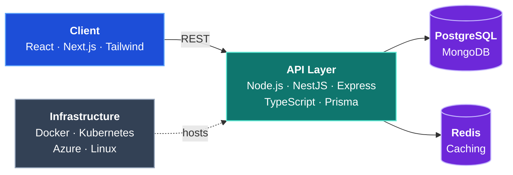

<div align="center">


<p>
  <a href="https://linkedin.com/in/YOUR_LINKEDIN"></a>
  <a href="mailto:YOUR_EMAIL"></a>
  <a href="https://github.com/jabezjesudasonjena?tab=followers"></a>
</p>

</div>

## `~/whoami`

```ts
const jabez = {
  role:       "Backend Engineer",
  education:  "Computer Science Engineering · 3rd year",
  experience: "1 yr as Team Lead Backend Developer · startup + MNC",
  currently:  "Interning · exposure to team-level technical decisions",
  focus:      ["Backend Engineering", "Systems Architecture", "Cybersecurity"],
  exploring:  ["Cloud & DevOps", "AI-driven automation"],
  openTo:     ["Internships", "Open source", "Collaboration"],
} as const;
```

## `~/architecture`

The way I like to think about a system, and the tools I use at each layer:


```mermaid
flowchart LR
    A["<b>Client</b><br/>React · Next.js · Tailwind"]:::client
    B["<b>API Layer</b><br/>Node.js · NestJS · Express<br/>TypeScript · Prisma"]:::api
    C[("<b>PostgreSQL</b><br/>MongoDB")]:::data
    D[("<b>Redis</b><br/>Caching")]:::data
    E["<b>Infrastructure</b><br/>Docker · Kubernetes<br/>Azure · Linux"]:::infra

    A -->|REST| B
    B --> C
    B --> D
    E -. hosts .-> B

    classDef client fill:#1d4ed8,stroke:#60a5fa,color:#ffffff,stroke-width:1.5px
    classDef api fill:#0f766e,stroke:#5eead4,color:#ffffff,stroke-width:1.5px
    classDef data fill:#6d28d9,stroke:#c4b5fd,color:#ffffff,stroke-width:1.5px
    classDef infra fill:#334155,stroke:#94a3b8,color:#ffffff,stroke-width:1.5px
```

<div align="center">


</div>

## `~/stats`

<div align="center">


</div>

<br/>

<div align="center">


</div>
